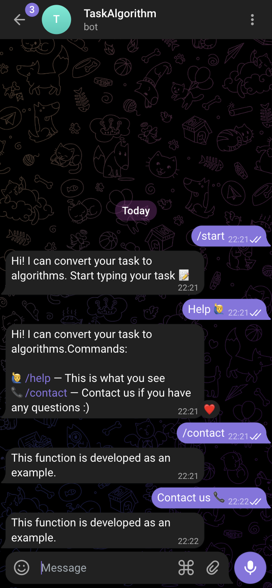
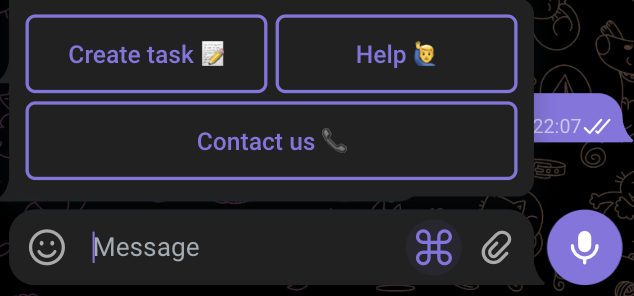

## **Application Initialization**

Next, we need to initialize the FastAPI application. Before the server starts, we must also initialize the python-telegram-bot within it. We will store the main logic in the `app.py` file.

!!!warning "Techie Alert in Tutorial Town!"
    Hey there, savvy coder! Before you dive headfirst into the cool waters of bot-making, let's not forget our digital life jackets: the imports! Imagine them as your coding BFFs, always there to back you up. Without these trusty imports, your bot might just end up swimming with the digital fishes.

### 1. **Create ENV variables**

Before starting, let's define the environment variables in a `.env` file located next to the `app.py` file, and load them in `settings.py` file.

```python
import os
from dotenv import load_dotenv

load_dotenv()


class Config:
    BOT_TOKEN = os.getenv('BOT_TOKEN')
```

### 2. **Initializing telegram bot application**

And then in `app.py` we should initialize python telegram bot application.

```python
from settings import Config
from telegram.ext import Application

ptb = Application.builder().token(Config.BOT_TOKEN).updater(None).build()
```

### 3. **Initializing FastAPI application**

After this we should define Fast api application with following lifespan:

```python
from fastapi import FastAPI
from telegram.ext import Updater


@asynccontextmanager
async def lifespan(app: FastAPI):
    updater = Updater(ptb.bot, update_queue=ptb.update_queue)
    await updater.initialize()
    await updater.start_polling(poll_interval=1)

    async with ptb:
        await ptb.start()
        yield
        await ptb.stop()


app = FastAPI(lifespan=lifespan)
```

Here we are polling message updates, to implement webhook logic as well we are going to add one more variable to our Config.

```python
class Config:
    ...
    URL =  os.getenv('APP_URL')  # https://example.com
```

We should add webhook API that handles new message updates and our lifespan changes to

```python
from contextlib import asynccontextmanager

from fastapi import FastAPI, Request, Response
from telegram import Update
from telegram.ext import Application, Updater

from settings import Config

ptb = Application.builder().token(Config.TOKEN).updater(None).build()


@asynccontextmanager
async def lifespan(app: FastAPI):
    if not Config.URL:
        updater = Updater(ptb.bot, update_queue=ptb.update_queue)
        await updater.initialize()
        await updater.start_polling(poll_interval=1)
    else:
        await ptb.bot.set_webhook(
            url=f'{Config.URL}/telegram',
            allowed_updates=Update.ALL_TYPES,
            drop_pending_updates=True,
        )

    async with ptb:
        await ptb.start()
        yield
        await ptb.stop()


app = FastAPI(lifespan=lifespan)


@app.post('/telegram')
async def process_update(request: Request):
    req = await request.json()  # Get message updates
    await ptb.update_queue.put(Update.de_json(data=req, bot=ptb.bot))  # Put message to queue
    return Response(status_code=200)  # Return success response
```

In this setup, If the config URL is set, we handle messages by webhook; otherwise, we start polling.

## **Managing Bot Message Updates**

Now we can create bot application routes to handle bot commands and actions.

There we should add taskalgobot module that contains `handlers.py` that consists actions logic and `keyboards.py` file that saves telegram keyboards.

### 1. **Handle star, help, contact commands**

For instance to start bot and get help about bot we should define commands logic

```python
# handlers.py
from telegram import Update
from telegram.ext import ContextTypes

from taskalgobot import keyboards


async def text_with_menu(update: Update, text: str) -> None:
    await update.message.reply_text(
        text=text,
        reply_markup=keyboards.menu_keyboards(),
    )


async def start_command(
    update: Update, context: ContextTypes.DEFAULT_TYPE,
) -> None:
    text = (
        'Hi! I can convert your task to algorithms.'
    )
    await text_with_menu(update, text=text)


async def help_command(
    update: Update, context: ContextTypes.DEFAULT_TYPE,
) -> None:
    text = (
        'Hi! I can convert your task to algorithms.\n'
        'Advice: 📝 Start typing to request algorithms without commands\n'
        'Commands:\n\n'
        '🙋‍♂️ /help — This is what you see\n'
        '📞 /contact — Contact us if you have any questions :)'
    )
    await update.message.reply_text(text=text)


async def contact_command(
    update: Update, context: ContextTypes.DEFAULT_TYPE,
) -> None:
    text = (
        'This function is developed as an example.'
    )
    await update.message.reply_text(text=text)
```

#### 1.1 **Handlers results**

Here in screenshot 2 we can see bot commands results.

{ width="300" }

*screenshot 2*

### 2 **Define menu keyboards**

```python
# keyboards.py
from telegram import ReplyKeyboardMarkup


def menu_keyboards():
    reply_keyboard = [
        [
            'Create task 📝',
            'Help 🙋‍♂️',
        ],
        [
            'Contact us 📞',
        ]
    ]
    return ReplyKeyboardMarkup(
        reply_keyboard,
        one_time_keyboard=False,
        resize_keyboard=True,
    )
```

#### 2.1 **Keyboards results**

This keyboards will look like (screenshot 3):

{ width="300" }

*screenshot 3*

### 3 **Handling various bot interactions**

In `app.py` file, we're using a Python Telegram Bot (ptb) application object which is crucial for handling various bot interactions.


```python
# app.py
from telegram.ext import (
    Application,
    CallbackQueryHandler,
    CommandHandler,
    MessageHandler,
    ConversationHandler,
    filters,
    Updater,
)

...

ptb.add_handler(CommandHandler('start', handlers.start_command))
ptb.add_handler(CommandHandler('help', handlers.help_command))
ptb.add_handler(CommandHandler('contact', handlers.contact_command))

ptb.add_handler(MessageHandler(
    filters.Regex("^(Create task 📝)"), handlers.start_command))
ptb.add_handler(MessageHandler(
    filters.Regex("^(Help 🙋‍♂️)"), handlers.help_command))
ptb.add_handler(MessageHandler(
    filters.Regex("^(Contact us 📞)"), handlers.contact_command))

ptb.add_handler(MessageHandler(
    filters.TEXT & ~filters.COMMAND, handlers.handle_task_to_algo))
```


#### 3.1 **Command Handlers – Our Bot's Reflexes:**

- When someone types /start, our bot jumps into action with handlers.start_command. It's like saying "Hello, world!" but way cooler.
- Need help? Just hit /help, and our handlers.help_command is there like a friendly neighborhood superhero.

#### 3.3 **Message Handlers – The Bot's Sixth Sense**

- When users get creative and type things like **"Create task 📝"**, our bot knows it's showtime, calling handlers.start_command to get the ball rolling.
- Do you need **"Help 🙋‍♂️"** with ***BOT***? They've got no secrets from us. Our bot knows exactly what to do, routing them to the right helper functions.

!!! note
    **"Contact us 📞"** has just made for demonstration purposes :)

#### 3.4 **Task to algorithm handler - The Bot's Intuition**

For all those times users just chat away, **`filters.TEXT & ~filters.COMMAND`** ensures nothing slips through. Every message is a chance for `handlers.handle_task_to_algo` to shine, turning user chats into action plans.

!!!Question "handlers.handle_task_to_algo"
    This function hasn't been implemented yet – stay tuned and keep your cool! 😊
