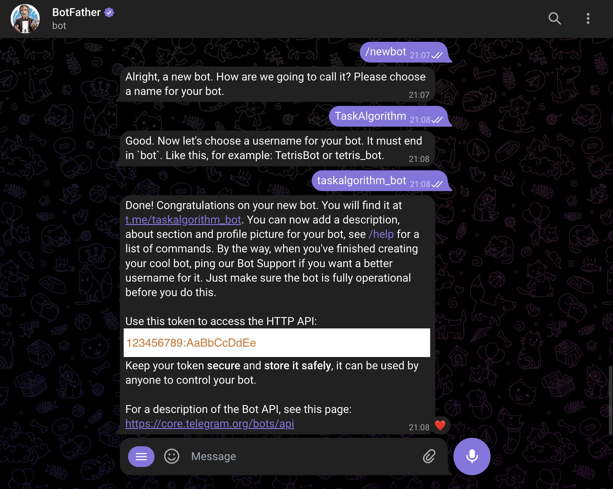

## **Bot setup**

To begin, you first need to create your Telegram bot. There are numerous online tutorials that can walk you through this process, or just write commands in **Screenshot 1** to **BotFather** in telegram. By the end of these steps, you should acquire an authentication token, which typically looks something like '123456789:AaBbCcDd'.


*screenshot 1*

## **Project setup**
Once our bot is up and raring to go, we're diving into the world of web servers, because, hey, our Telegram bot loves to chat using webhooks and polling! Enter **FastAPI** - our superhero web server that's not only strong but also super friendly for us developers.

With the `python-telegram-bot` library joining our tech squad, our bot will be chatting like a pro, thanks to its smooth talks with the Telegram API. And guess what? We're giving our bot a dose of AI smarts by hooking it up with the `openai` **ChatGPT** package. This means our bot won't just listen; it'll engage, thanks to some next-level chit-chat skills.

But there's more - we're also bringing in the `instructor` package to make sense of all that GPT gab, and `Pydantic` schemas will ensure everything's tidy and in order, data-wise. So, we're all set to create an app that doesn't just talk the talk but walks the walk, delivering snappy, smart responses every time!

Before starting the coding process, you need to set up an organized workspace for your application, which we will name **"taskalgorithm"**. Here's a step-by-step guide to get your environment ready:

### 1. **Create a Project Folder**
Begin by creating a folder named **"taskalgorithm"** to house all your application files.

```bash
mkdir taskalgorithm
cd taskalgorithm
```

### 2. **Set Up a Virtual Environment**
Using a virtual environment is crucial for managing dependencies specific to your project without affecting the global Python environment.

To create a virtual environment, execute:

```bash
python -m venv venv
```

To activate the virtual environment, use:

```bash
source venv/bin/activate  # On Unix/macOS
.\venv\Scripts\activate  # On Windows
```

### 3. **Install Required Packages**

Once your environment is active, you need to install the necessary libraries. Storing all the dependencies in a `requirements.txt` file simplifies this process.

First, create a `requirements.txt` file and list the following packages:


```text
fastapi==0.109.2
uvicorn==0.27.1
python-telegram-bot==20.8
openai==1.12.0
python-dotenv==1.0.1
pydantic==2.6.1
instructor==0.6.0
```

Then, install these packages using pip:

```txt
pip install -r requirements.txt
```

By following these steps, you'll have a solid foundation to start developing your **"TaskAlgorithmBot"** application, with all the necessary Python packages installed within an isolated environment.
