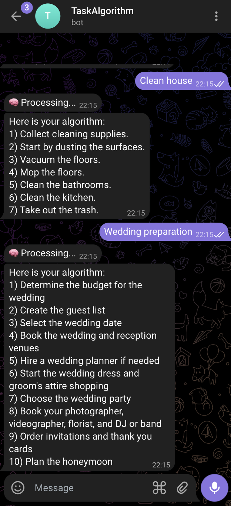

## **🏁 Results**

At the end we should get this results (screenshot 4):

{ width="300" }

*screenshot 4*

!!!info
    For those eager to explore the complete code and delve deeper into how everything comes together, please visit my [GitHub page](https://github.com/aotegaliyev/taskalgorithm).

Your insights and inquiries are highly valued, so feel free to connect if you have any questions or feedback. Dive into the code, get inspired, and see how you can adapt these insights to your own projects!

## **🎀 Wrapping It Up With a Bow**

{ width="300", align="left" }

Alright, we've had our fun, mixed in a dash of code, and voila – **ChatGPT** is now part of our Telegram bot family, making AI seem like a piece of cake. We've jazzed up our bot with some **ChatGPT** smarts, and now it's all set to show off, whether it's in customer service, keeping projects on track, or even teaching folks a thing or two.

This journey wasn't just about getting geeky with AI; it was about giving our tech tools a brain boost. Now our bot isn't just any bot – it's a super-bot, ready to dive into tasks with flair and finesse.

So, what's next? Dream big, because with **ChatGPT** in your toolkit, your projects are going to shine, turning the mundane into the extraordinary. Here's to the future – it's looking bright, and oh-so-clever! 🌟🤖✨
